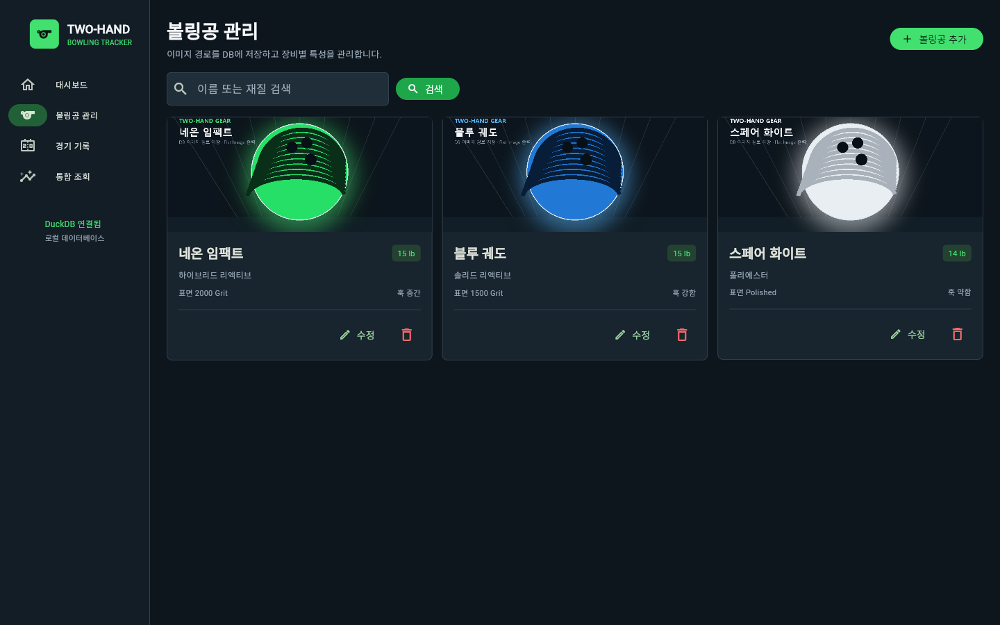
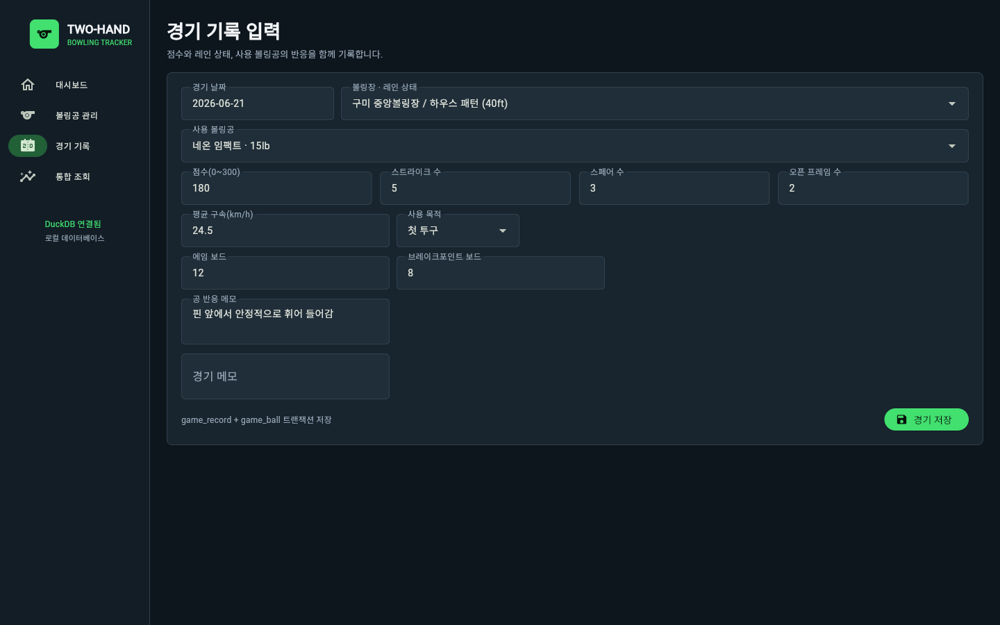
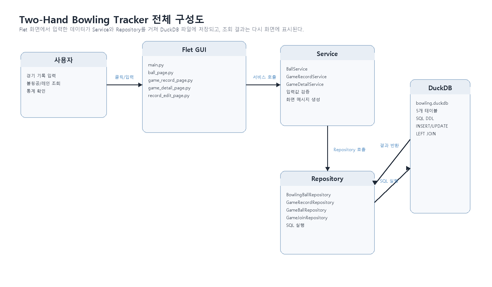
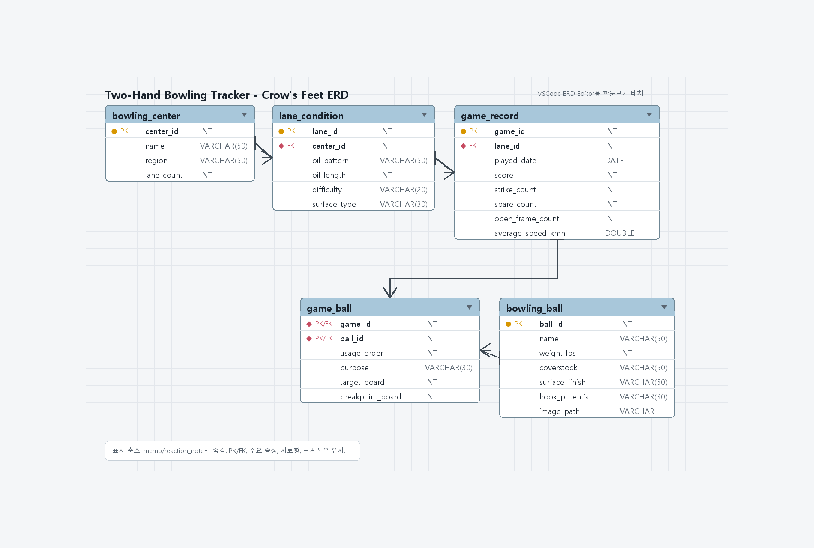

# Two-Hand Bowling Tracker

Flet과 DuckDB로 구현한 개인용 투핸드 볼링 경기·장비 기록 애플리케이션입니다. 경기 점수뿐 아니라 볼링장, 레인 상태, 사용한 볼링공, 투구 위치와 공의 반응을 관계형 데이터로 함께 저장합니다.

## 실행 화면


| 볼링공 관리 | 경기 기록 입력 |
|---|---|
|  |  |


## 과제 제한 요소

| 요구 사항 | 구현 내용 |
|---|---|
| 테이블 3개 이상 | Entity와 Relationship을 포함한 5개 테이블 생성 |
| 데이터 삽입 | `seed.sql`로 모든 테이블의 초기 데이터 삽입 |
| 3개 이상 테이블 JOIN | 5개 테이블 `LEFT JOIN` 통합 조회 |
| Flet GUI | 한국어 대시보드, 장비 관리, 경기 입력, 통합 조회 구현 |
| DuckDB 접근 | Repository 계층에서 매개변수 바인딩 SQL 실행 |
| 이미지 저장·출력 | DB에 상대 경로를 저장하고 Flet `Image`로 출력 |
| CRUD | 볼링공 및 경기 기록의 조회·등록·변경·삭제 |

## 전체 구조



- `main.py`: Flet 화면과 사용자 이벤트 처리
- `services.py`: 입력값 검증과 Use Case 흐름 제어
- `repositories.py`: 테이블 CRUD와 5개 테이블 JOIN
- `database.py`: DuckDB 연결과 스키마 초기화
- `schema.sql`: 테이블, PK/FK, CHECK 제약조건
- `seed.sql`: 볼링장·레인·볼링공·경기 초기 데이터
- `tests/test_repositories.py`: Repository와 DuckDB 통합 테스트

## 데이터베이스 설계



| 테이블 | 구분 | 역할 |
|---|---|---|
| `bowling_center` | Entity | 볼링장 이름과 지역 |
| `lane_condition` | Entity | 볼링장별 오일 패턴과 난이도 |
| `bowling_ball` | Entity | 보유 볼링공 정보와 이미지 경로 |
| `game_record` | Entity | 경기 날짜, 점수, 프레임 결과와 메모 |
| `game_ball` | Relationship | 경기와 사용 볼링공의 다대다 관계 |

통합 조회에서는 경기 정보가 관계 데이터 누락 때문에 사라지지 않도록 `LEFT JOIN`을 사용합니다.

```sql
FROM game_record g
LEFT JOIN lane_condition l ON l.lane_id = g.lane_id
LEFT JOIN bowling_center c ON c.center_id = l.center_id
LEFT JOIN game_ball gb ON gb.game_id = g.game_id
LEFT JOIN bowling_ball b ON b.ball_id = gb.ball_id
```

## 실행 방법

Python 3.11 이상 환경을 권장합니다.

```powershell
python -m pip install -r requirements.txt
python make_assets.py
python main.py
```

실행 후 브라우저에서 `http://127.0.0.1:8550`에 접속합니다. DuckDB 파일과 초기 데이터는 첫 실행 시 `data/bowling_tracker.duckdb`에 생성됩니다.

## 테스트

```powershell
python -m unittest discover -s tests -v
```

테스트는 다음 항목을 확인합니다.

- 5개 테이블 생성 및 초기 데이터 삽입
- 볼링공 CRUD와 이미지 경로 저장
- 경기와 사용 공 관계의 트랜잭션 저장
- 5개 테이블 LEFT JOIN 결과
- 경기 점수 수정과 관계 데이터를 포함한 삭제

## 사용 기술

- Python 3
- Flet 0.85.3
- DuckDB 1.5.4
- Pillow 12.2.0

## Repository

https://github.com/osangmin51-spec/database
