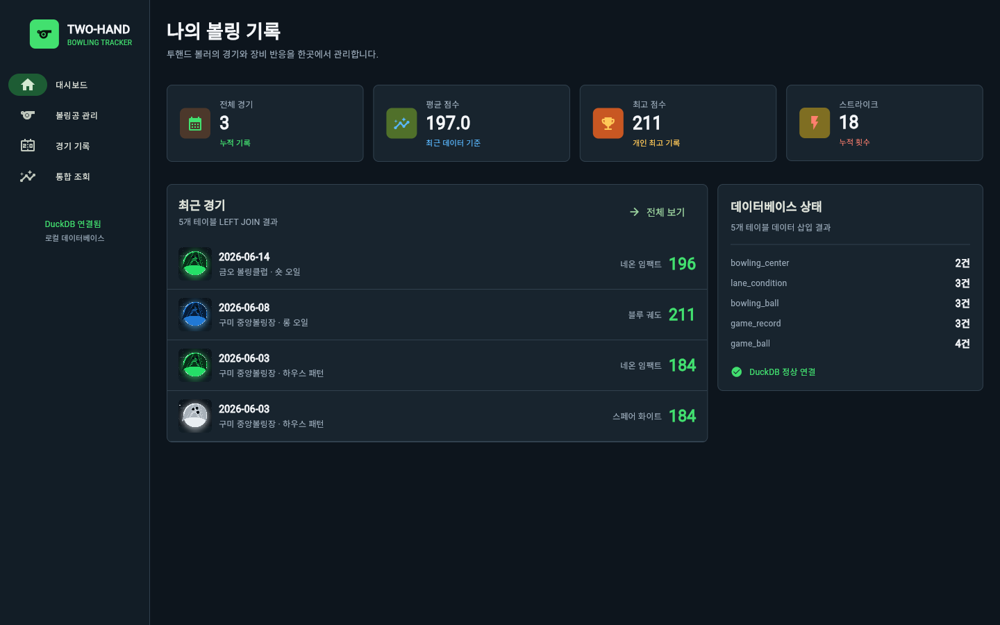
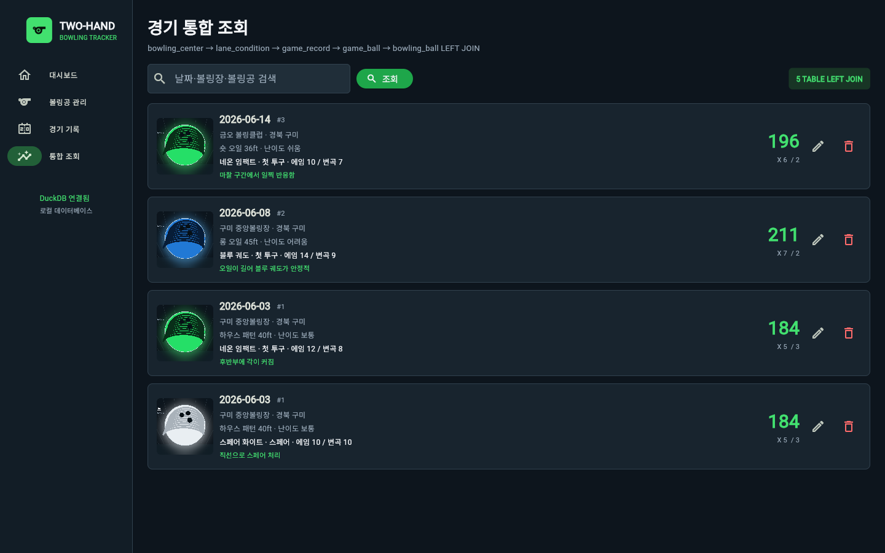

# Two-Hand Bowling Tracker

Flet과 DuckDB로 만든 개인 볼링 경기·장비 기록 애플리케이션입니다.



## 주요 기능

- 5개 테이블 생성 및 초기 데이터 삽입
- 볼링공 검색·추가·수정·삭제
- 경기 기록과 사용 볼링공 관계를 트랜잭션으로 저장
- 5개 테이블 `LEFT JOIN` 통합 조회
- DB에 저장한 이미지 경로를 Flet `Image`로 출력
- 경기 점수·메모 수정 및 관계 데이터를 포함한 삭제



## 실행 방법

```powershell
python -m pip install -r requirements.txt
python make_assets.py
python main.py
```

브라우저에서 `http://127.0.0.1:8550`으로 실행됩니다.

## 테이블

- `bowling_center`: 볼링장 정보
- `lane_condition`: 볼링장별 레인 상태
- `bowling_ball`: 보유 볼링공과 이미지 경로
- `game_record`: 경기 결과
- `game_ball`: 경기와 사용 볼링공의 다대다 관계

## 저장소

https://github.com/osangmin51-spec/database
